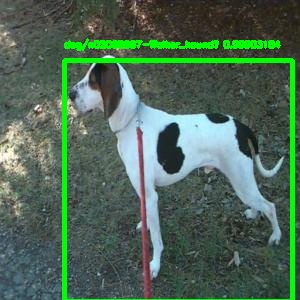

# keras_tests
Some projects using Keras for learning and classification tasks

# Dog/cat breed classification 
This code solves classification problem of finding dogs and cats on images and recognizing their breeds. The models were traind on 120 breeds of dogs and 12 breeds of cats. 

The actual solution works in 2 steps:
1. Pretrained Yolo v3 [1] image detection model is used to find cats and dogs in the image.
2. Depending on the animal found in the image, the bounding box is passed to the breed classifier (there are different classifiers for different animals) that returns 3 most probable breeds of that animal.
 
Each of these classifiers is based on the Xception [2] model pretrained on the Imagenet [3] was fine-tuned on datasets with cat and dog breeds.
The system can be directly deployed. When the `FullEvaluator` started, it can automatically load the saved models - animal detector and breed classifiers - and is prepared to classify images it is given.

Initial inspiration of the solution is based on article https://medium.com/@iliazaitsev/dogs-breeds-classification-with-keras-b1fd0ab5e49c

## Model Accuracy
Accuracy in localization of the correct animals is 90.2%. Accuracy of correct breed being in top 3 or top 1 results is shown in the following table
| Accuracy |    Dog   |  Cat   | Total  |
|----------|:--------:|-------:|-------:|
| Top-3    |  77.4 %  | 85.1 % | 78.1 % |
| Top-1    |  59.1 %  | 55.1 % | 58.7 % |

## Some Results
Correct classifications: 

    
    
    

Incorrect classifications: 

    
    

[1] Redmon, J. and Farhadi, A., 2018. Yolov3: An incremental improvement. arXiv preprint arXiv:1804.02767.

[2] Chollet, F., 2017. Xception: Deep learning with depthwise separable convolutions. In Proceedings of the IEEE conference on computer vision and pattern recognition (pp. 1251-1258).

[3] Deng, J., Dong, W., Socher, R., Li, L.J., Li, K. and Fei-Fei, L., 2009, June. Imagenet: A large-scale hierarchical image database. In 2009 IEEE conference on computer vision and pattern recognition (pp. 248-255). Ieee.
